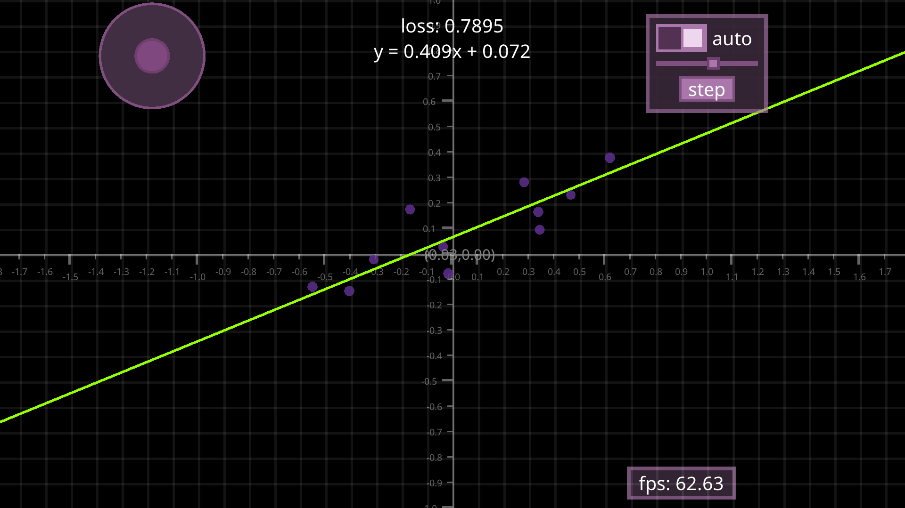

# Lineup 📉



Lineup is a high-performance, interactive visualization tool designed for exploring linear regression through real-time animation. Built entirely in C using the custom Gama engine, this project demonstrates the implementation of gradient descent algorithms in a graphical environment, allowing users to watch a mathematical model "learn" from data points dynamically.

## Overview
This project serves as both a mathematical playground and a showcase of low-level systems programming. It features a custom memory allocator, a hand-coded math library, and a reactive UI system—all working in unison to calculate and render the best-fit line for user-defined datasets.

## Features
- **Interactive Data Plotting**: Add or manipulate data points directly on a Cartesian coordinate system with simple mouse interactions.
- **Animated Learning**: Watch the regression line adapt to new data in real-time using a gradient descent epoch system.
- **Custom UI Components**: Includes interactive sliders for learning rate adjustment, toggle switches for autoplay, and an animated joystick for viewport navigation.
- **Robust Math Engine**: Implements custom trigonometric and logarithmic functions from scratch, reducing dependency on external standard libraries.
- **Deterministic Memory Management**: Utilizes a specialized memory pool and bookkeeping system to ensure stability and efficiency.

## Technologies Used
| Technology | Purpose |
| :--- | :--- |
| [C Language](https://en.cppreference.com/w/c) | Core logic and systems programming |
| [Gama Engine](https://github.com/ken-morel/gama) | Graphics, input handling, and UI framework |
| [Clang/LLVM](https://clang.llvm.org/) | Compilation and optimization |
| [Linear Regression](https://en.wikipedia.org/wiki/Linear_regression) | Mathematical modeling and gradient descent |

## Getting Started

### Installation
Follow these steps to set up the project on your local machine:

- **Step 1: Clone the Repository**
  ```fish
  git clone git@github.com:ken-morel/lineup.git
  cd lineup
  ```

- **Step 2: Install Dependencies**
  Ensure you have `clang` and the `gama` installed on your system, or you can bulid the project using code blocks. If you are on Linux, ensure you have the necessary development headers for your display server (X11/Wayland) or ensure you have zig installed and in path if you want to build for the web.

- **Step 3: Build the Project**
  You can build the project using the provided Code::Blocks project file or via gama:
  ```fish
  gama build
  gama build -r # directly run the application
  ```

- **Step 4: Run the Application**
  ```fish
  gama run
  ./build/bin/lineup
  ```

## Usage
Once the application is running, you can interact with the environment using the following controls:

- **Adding Points**: Click anywhere on the grid to place a data point.
- **Modifying Data**: Click and drag existing points to see how the loss function changes.
- **Training**: 
  - Press **Space** to run a single training epoch.
  - Toggle the **Auto** switch in the UI to let the model train continuously.
- **Adjustments**: Use the on-screen **Scale** slider to increase or decrease the learning rate (step size) of the gradient descent.
- **Navigation**: Use the UI joystick or arrow keys to move the point cloud.
- **Deletion**: Hover over a point and press **D** or **S+D** to remove it.
- **Exit**: Press **Shift + E** to quit the application.

## Contributing
Contributions are welcome! If you're looking to improve the math engine or UI performance, please follow these steps:

- 💡 **Open an Issue**: Discuss major changes before starting work.
- 🍴 **Fork the Repo**: Create your feature branch.
- 🛠️ **Submit a PR**: Ensure your code follows the existing style and is well-documented.
- ✅ **Test**: Verify that the linear regression logic remains accurate after changes.

## Author Info
**Ken Morel**
- GitHub: [ken-morel](https://github.com/ken-morel)
- Twitter: [@kenmorel8](#)

---


[](https://www.npmjs.com/package/dokugen)
